

# Creation of an Automatic Annotation Pipeline using AI

Diploma Thesis / Final year project

**Author**: Benoît Vidotto

**ISIA Lab ,Polytech Mons (FPMs), UMONS, Belgium**

This project aims to develop an automatic annotation pipeline to create a database of annotated images, specifically for human body parts. Conducted by Benoît Vidotto, this work is part of a final project at the University of Mons.

<figure align="center">
    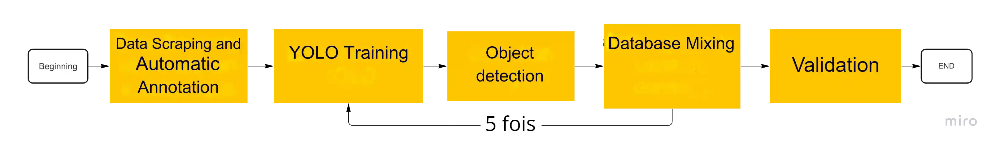
</figure>

## Table of Contents

- [Introduction](#introduction)
- [Content](#content)
- [Databases](#databases)
  - [Pascal Database](#pascal-database)
- [Object Detection Metrics](#object-detection-metrics)
- [Object Detection Systems](#object-detection-systems)
  - [YOLO](#yolo)
  - [NanoDet](#nanodet)
  - [MediaPipe](#mediapipe)
- [Automatic Annotation and Detection Pipeline](#automatic-annotation-and-detection-pipeline)
- [Data Scraping](#data-scraping)
- [Results and Conclusions](#results-and-conclusions)
- [Improvement Perspectives](#improvement-perspectives)
- [Questions?](#questions)
- [References](#references)

This document starts by the creation of the database, then the training of a object detection system and finally by the validation of the training.
<figure align="center">
    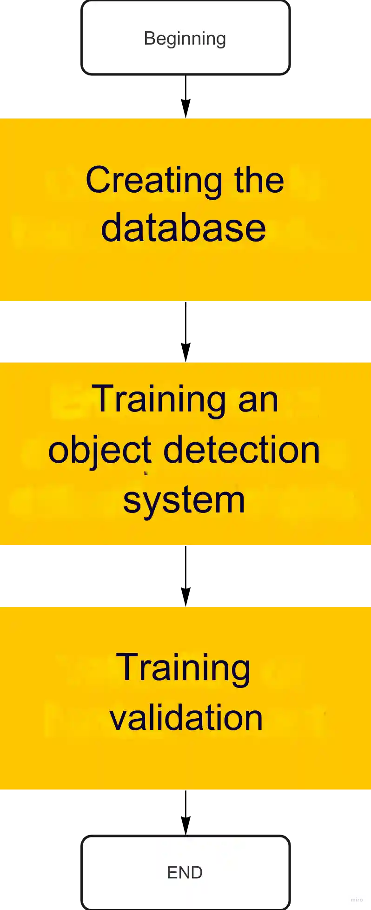
</figure>

## Introduction

The main objective is to implement a method for automatically annotating images representing body parts. This process relies on the use of object detection algorithms and advanced annotation systems.
<figure align="center" width="100%">
    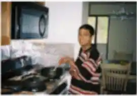
    
    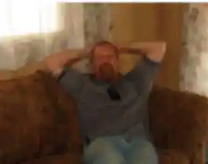
    
</figure>
<figure align="center">
    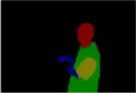
    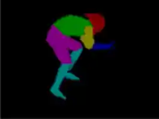
    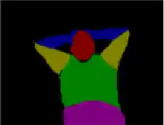
    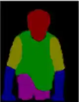
    <figcaption>Examples of human body parts segmentation [1]</figcaption>
</figure>

## Databases

To train a human body part detection algorithm, it is necessary to have:
- A database containing more than 1500 varied images.
- Blank images to reduce false positives.
- Many instances per object category (> 10,000), including head, torso, and upper and lower limbs.

### Pascal Database

The database used comes from the PASCAL VOC project, which aimed to improve computer vision databases between 2005 and 2012. This database has been modified to annotate subcategories and contains:
- 20 categories and 192 subcategories, with 24 subcategories for humans.
- 10,103 images, of which 3,590 contain humans.
<figure align="center">
    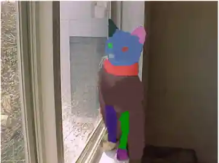
    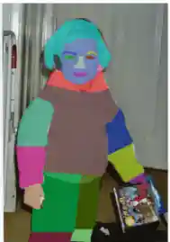
    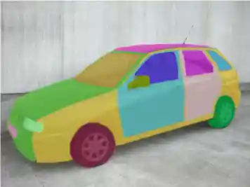
    <figcaption>Sample of the PASCAL VOC project [1]</figcaption>
</figure>

## Object Detection Metrics

The performance of detection systems is evaluated using several metrics, including:
- **Intersection over Union (IoU)**: Defines the binary state of a detection (correct or incorrect) based on a threshold, it measures the accuracy of a detection.
  $$  IoU = \frac{\text{Area of Overlap}}{\text{Area of Union}}  $$
- **Confusion Matrix**: Compiles binary classification results, defining precision and recall.

$$  \text{Precision} = \frac{TP}{TP + FP} \quad \text{Recall} = \frac{TP}{TP + FN}  $$

<figure align="center">
    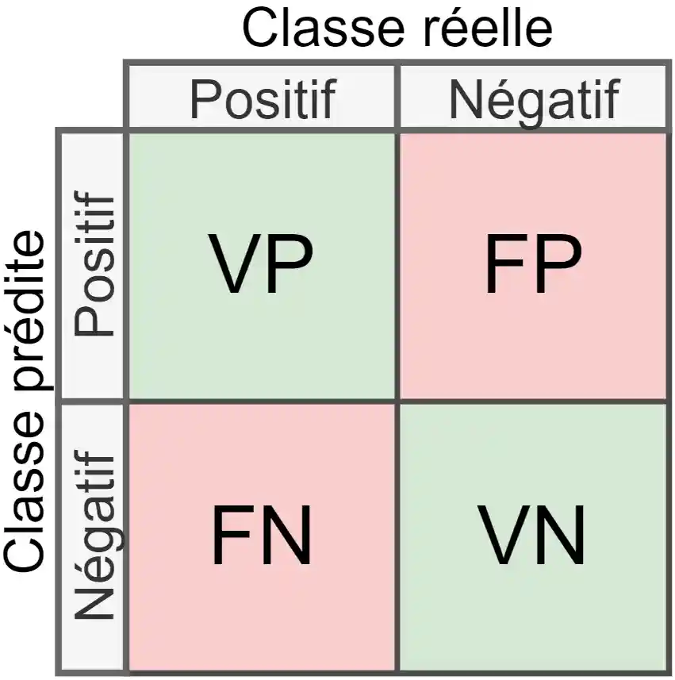
    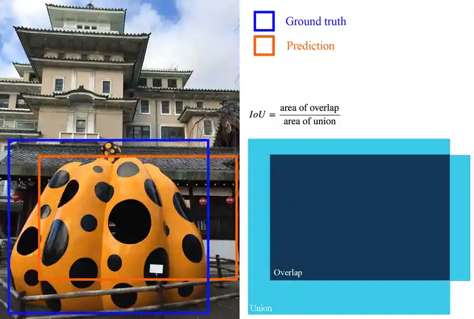
    <figcaption>On the left, the confusion matrix (in french). On the right, the intersection over union [3]</figcaption>
</figure>

- **Average Precision (AP)** and **mean Average Precision (mAP)** are defined by the integral of the Precision-Recall curve, requiring an IoU threshold (set at 0.5 unless specified otherwise). A larger integral indicates high precision and recall values, suggesting good performance. AP is used per category, while mAP averages the AP across all categories. Higher mAP values indicate better system performance.

<figure align="center">
    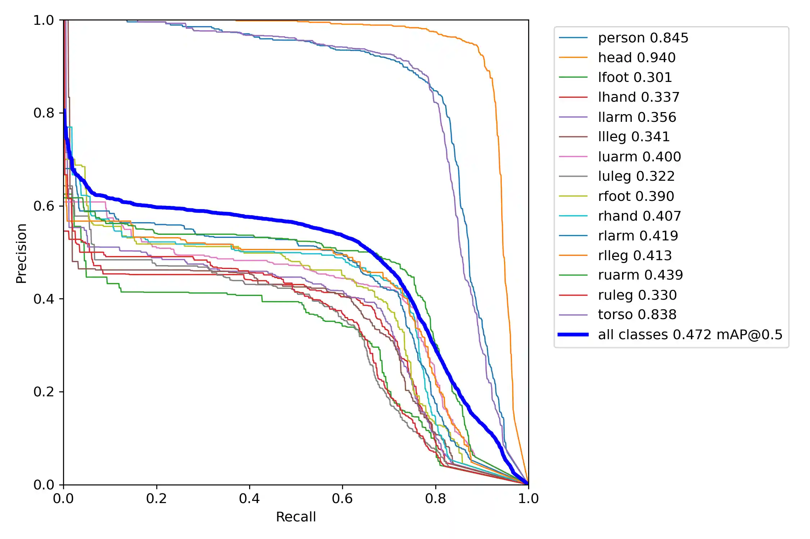
    <figcaption>AP and mAP</figcaption>
</figure>

## Object Detection Systems

### YOLO [2]

- A one-stage object detector using a convolutional neural network (CNN).
- Reported performance: mAP of 42.1% with a required power of 77.96 GFLOPS.

### NanoDet [3]

- A lightweight object detector, also based on a CNN, designed for real-time applications on mobile.
- Reported performance: mAP of 30.4% with a required power of 1.79 GFLOPS.

### MediaPipe

- A tool for pose estimation that generates a skeleton per image containing humans.
<figure align="center">
    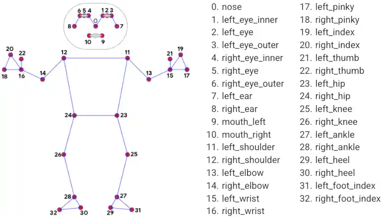
    <figcaption>Segmentation used by MediaPipe [5]</figcaption>
</figure>
- The numerical association of skeleton joints allows for the segmentation of human body parts using the smallest bounding rectangle enclosing key points.
<figure align="center">
    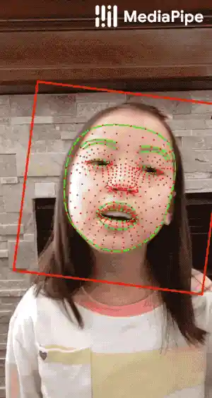
    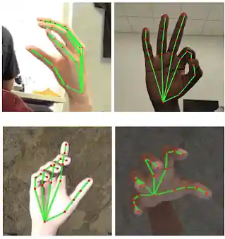
    <figcaption>Examples using MediaPipe [5]</figcaption>
</figure>
- MediaPipe can detect only one skeleton per image. YOLO is employed to detect humans, and MediaPipe is applied to each detected individual.
<figure align="center">
    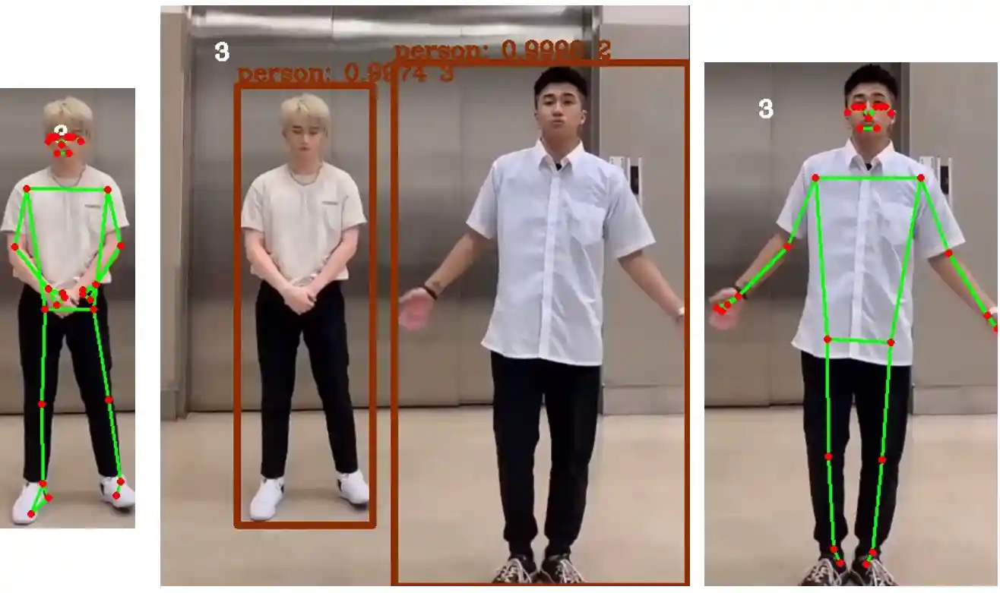
    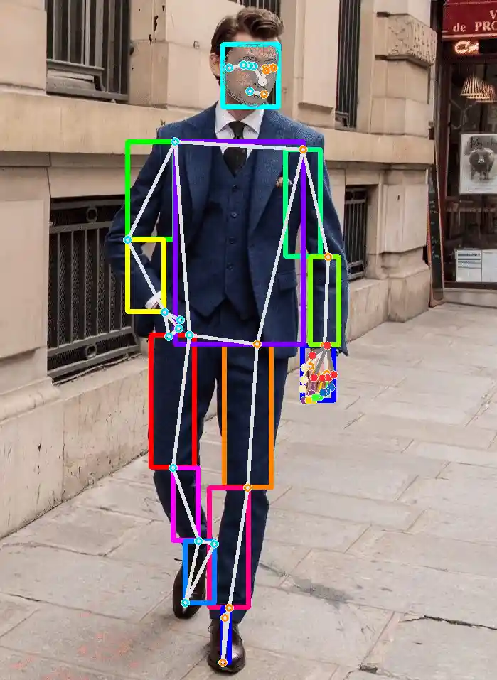
    <figcaption>Detection of multiple people [6](left) and body part segmentation using MediaPipe (right)</figcaption>
</figure>

### Detection System Comparison
- mAP results show: MediaPipe (9.11%) < NanoDet (30.4%) < YOLO (45.1%).
- While MediaPipe effectively detects people (via YOLO), it struggles with foot detection.
<figure align="center">
    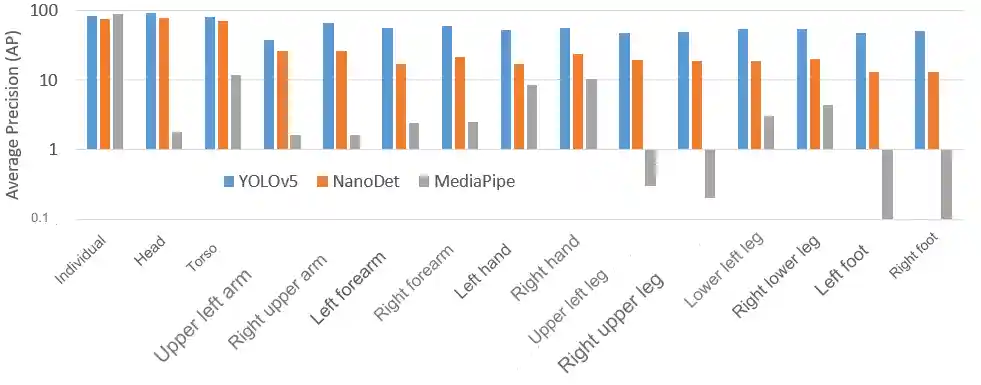
    <figcaption>Detection System Comparison</figcaption>
</figure>

## Automatic Annotation and Detection Pipeline

The pipeline consists of several steps:
- **Creating the database** from sitcom scenes collected through data scraping.
- Automatic annotation of images using MediaPipe.
- Training loop for a body part detection model, allowing for simulated training on a larger database.

<figure align="center">
    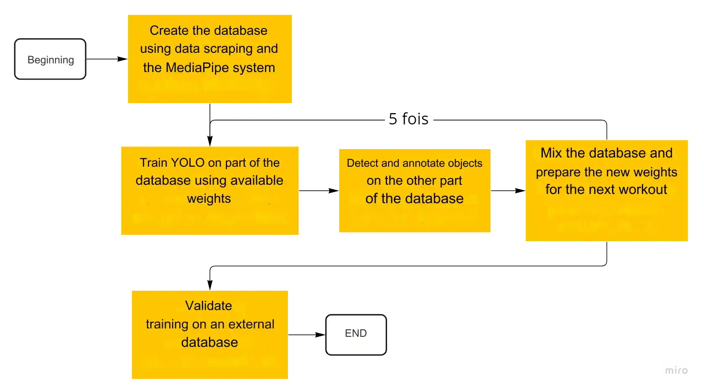
    <figcaption>Automatic Annotation and Detection Pipeline</figcaption>
</figure>

## Data Scraping

Data scraping is a method of collecting data from the internet, enabling rapid retrieval of a large number of images. For this project, images were collected using the DuckDuckGo search engine, employing the keywords "sitcom scene" in order to collect the most images that mimick the most the ordinary life.

## Annotations

- The "sitcom scene" database contains only 800 images.
- Automatic annotation yields the following insights:
  - Uneven distribution of body parts; the lower body is underrepresented.
  - Foot categories are poorly represented, complicating their detection.
  - The category of people is most prevalent, indicating easier detection.

<figure align="center">
    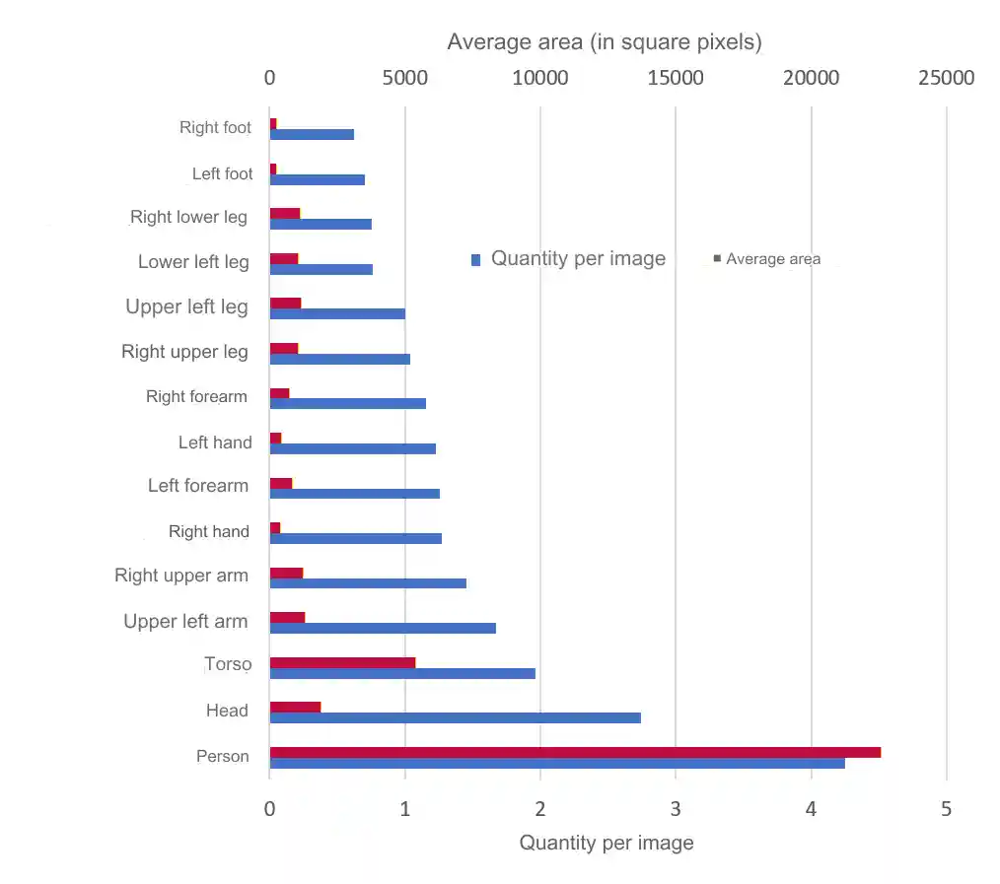
    <figcaption>Average area and quantity of body part per image</figcaption>
</figure>

## Hypothesis
- Training database is sitcom-based.
- Automatic annotation is performed with MediaPipe.
- YOLO was trained for 200 epochs at each iteration.
- Validation uses the Pascal database to ensure fidelity.
<figure align="center">
    
    <figcaption>Automatic Annotation and Detection Pipeline</figcaption>
</figure>

## Results and Conclusions

The results indicate that:
- The model achieved a mAP of 78.8% on the "sitcom" training database.
- For validation on the Pascal database, the mAP dropped to 10.1%.
- People, torsos, and heads were the most detected, while feet were not detected at all.
- Confusion between left and right limbs was also observed, leading to numerous false negatives, **indicating an overfitting issue**.

<figure align="center">
    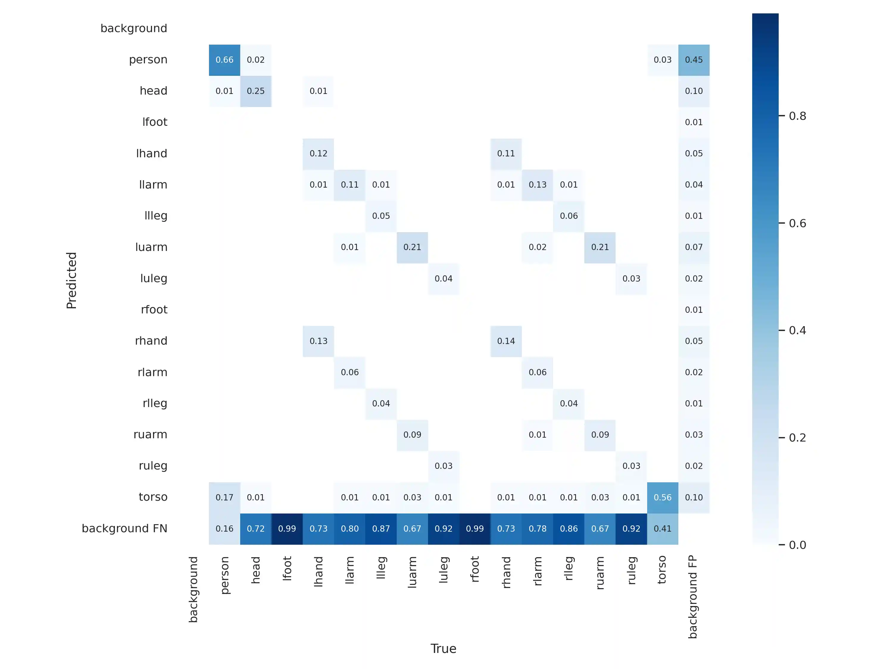
    <figcaption>Results of using the pipeline on the sitcom database</figcaption>
</figure>

**Alternative Database:**
- A new data scraping method created a human activity database from YouTube (MPII):
  - 25,000 images across 410 activities (sports, household, aquatic, musical, etc.).
  - 10 videos per activity.

### Training Results on MPII Database
- No longer distinguishing between left and right limbs.
- Training mAP from YouTube data: 83.7%.
- Validation mAP on Pascal: 17%.
- Improved detection of people with fewer false positives; detection distribution is more homogeneous but still includes many false negatives.

<figure align="center">
    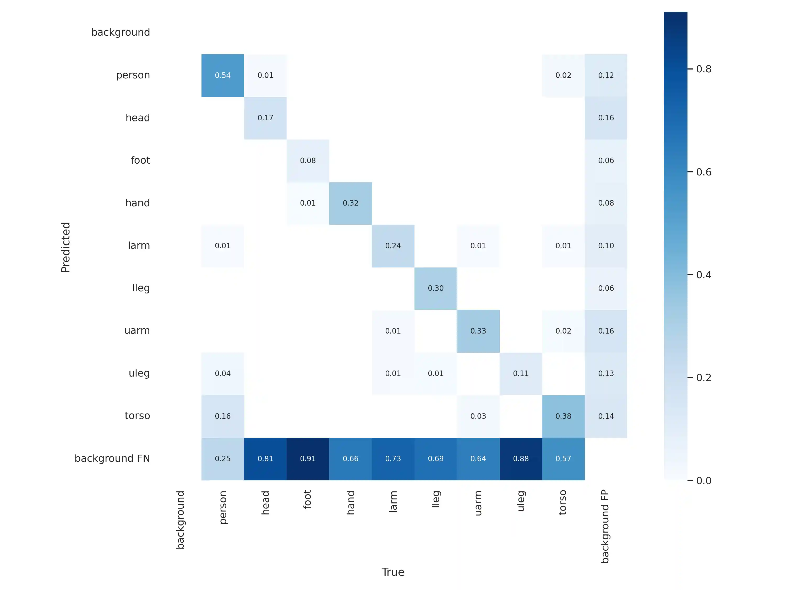
    <figcaption>Results of using the pipeline on the MPII database</figcaption>
</figure>

## Conclusion
- Comparison of object detection systems shows YOLO as the most effective on the Pascal database, with an mAP of 60.6%.
- An automatic annotation and detection pipeline for human body parts was created:
  - Annotations generated using MediaPipe.
  - The sitcom database was insufficient (mAP of 10.1%).
  - Better performance was achieved with the YouTube-based MPII database (mAP of 17% on Pascal validation).
  - Possible improvements remain.

## Perspectives for Improvement
- **Bounding Boxes**: The automatic annotation method using skeletons can be improved by utilizing segmentation masks.
- **Fine Tuning**: Freezing the weights of the initial layers of YOLO can prevent retraining these layers.
- **Hyperparameter Modifications**: Various parameters can alter the pipeline’s performance, including the confidence levels in object predictions.

## References

1. Chen, X., et al. "Detect What You Can: Detecting and Representing Objects using Holistic Models and Body Parts." [arXiv](http://arxiv.org/abs/1406.2031).
2. Jocher, G., et al. "ultralytics/yolov5: v6.1." [Zenodo](https://doi.org/10.5281/zenodo.6222936).
3. Hui, J. "mAP (mean Average Precision) for Object Detection." [Medium](https://jonathan-hui.medium.com/map-mean-average-precision-forobject-detection-45c121a31173).
4. RangiLyu. "NanoDet-Plus." [GitHub](https://github.com/RangiLyu/nanodet).
5. Google. "MediaPipe." [GitHub](https://google.github.io/mediapipe/).
6. Tng, S. "Multi-Person Pose Estimation with Mediapipe." [Medium](https://shawntng.medium.com/multi-person-pose-estimation-with-mediapipe52e6a60839dd).
7. Zhao, B. "Web Scraping." May 2017.

## Authors & contributors

The original setup of this repository is by [Benoît Vidotto][bvidotto].

## License

MIT License

Copyright (c) 2024 Benoît Vidotto

Permission is hereby granted, free of charge, to any person obtaining a copy
of this software and associated documentation files (the "Software"), to deal
in the Software without restriction, including without limitation the rights
to use, copy, modify, merge, publish, distribute, sublicense, and/or sell
copies of the Software, and to permit persons to whom the Software is
furnished to do so, subject to the following conditions:

The above copyright notice and this permission notice shall be included in all
copies or substantial portions of the Software.

THE SOFTWARE IS PROVIDED "AS IS", WITHOUT WARRANTY OF ANY KIND, EXPRESS OR
IMPLIED, INCLUDING BUT NOT LIMITED TO THE WARRANTIES OF MERCHANTABILITY,
FITNESS FOR A PARTICULAR PURPOSE AND NONINFRINGEMENT. IN NO EVENT SHALL THE
AUTHORS OR COPYRIGHT HOLDERS BE LIABLE FOR ANY CLAIM, DAMAGES OR OTHER
LIABILITY, WHETHER IN AN ACTION OF CONTRACT, TORT OR OTHERWISE, ARISING FROM,
OUT OF OR IN CONNECTION WITH THE SOFTWARE OR THE USE OR OTHER DEALINGS IN THE
SOFTWARE.